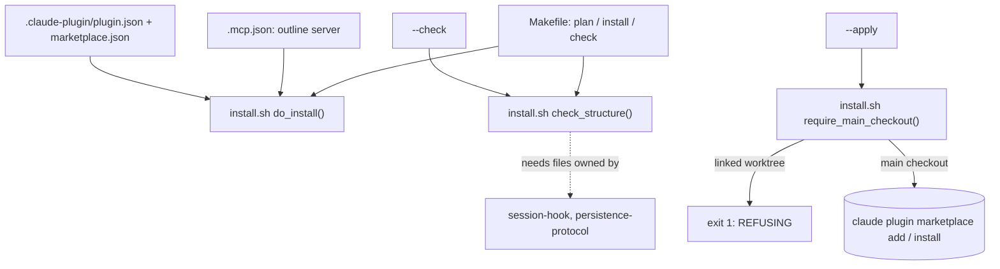

# packaging

What makes `worklog-persist` a plugin the `claude` CLI can register, install and
validate, plus the offline dev loop around it (`Makefile`, `pyproject.toml`,
`uv.lock`). Read [`CONVENTIONS.md`](../CONVENTIONS.md) first if you have not.

## Boundary

This block owns identity and packaging, not behaviour. It does not own what the
hook prints, what the skill reads or writes, or how the off switch resolves its
state file. Those live in [session-hook](../session-hook/README.md) and
[persistence-protocol](../persistence-protocol/README.md).

| Path | What it is |
|---|---|
| `.claude-plugin/plugin.json` | Plugin identity: name `worklog-persist`, version, description, license [verified] |
| `.claude-plugin/marketplace.json` | Local marketplace `worklog-persist-marketplace` listing the plugin with `source: "./"` [verified] |
| `.mcp.json` | The one bundled MCP server, `outline`, an HTTP endpoint with env-only headers [verified] |
| `install.sh` | Dry-run-by-default installer: register, install, enable, disable, uninstall, `--check` [verified] |
| `Makefile` | `help`, `test`, `test-sh`, `lint`, `check`, `live`, `plan`, `install` targets [verified] |
| `pyproject.toml` | Pins the test runner only; `tool.uv.package = false` [verified] |
| `uv.lock` | Resolved dev dependency versions for `uv run` [verified] |
| `.gitignore` | Excludes caches, the venv, and generated tdd-guard data [verified] |

## Why the dependencies

`install.sh::check_structure()` requires `scripts/session-start.sh` (owned by
[session-hook](../session-hook/README.md)) and `commands/load.md`,
`commands/checkpoint.md`, `skills/worklog-persist/SKILL.md`,
`scripts/redact.py`, `scripts/resolve-context.sh` (owned by
[persistence-protocol](../persistence-protocol/README.md)) to exist at those
exact paths, so packaging's own validator breaks if either block moves or
renames a file it owns [verified]. `.mcp.json`'s server name also fixes half of
the MCP tool prefix that persistence-protocol's skill has to search for; see
[`persistence-protocol/CONTRACTS.md`](../persistence-protocol/CONTRACTS.md) for
the consuming side [inferred].

## Flow

## More

- [`CONTRACTS.md`](CONTRACTS.md): manifest shapes, the install CLI, the MCP
  server entry, the tool-prefix mechanism, Makefile targets.
- [`INVARIANTS.md`](INVARIANTS.md): what must stay true, and the defect each
  invariant blocks.
- [`GAPS.md`](GAPS.md): the hardcoded Outline URL, the install-time cache
  question, and other unenforced edges.
- [`OPERATIONS.md`](OPERATIONS.md): every entry point, uninstall, and stuck
  states.
- [`DECISIONS.md`](DECISIONS.md): why dry-run by default, why the worktree
  refusal, why the plugin is named `worklog-persist`, why `uv` plus a
  non-package `pyproject.toml`.
- Test suites for this block's contracts live under `tests/`, documented in
  [verification](../verification/README.md).
