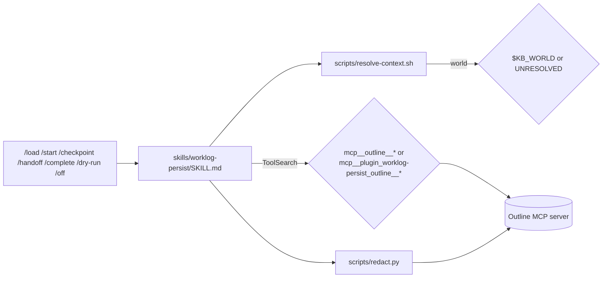

# persistence-protocol

What to read, write, redact and never hardcode. This block is the plugin's
operational contract: the skill text, the seven slash commands that trigger it,
and the two helper scripts that resolve identity and strip secrets.

It never talks to Outline directly. It writes prompt text that tells the agent
which MCP tools to call and how to shape the record; the actual connection (the
`outline` server definition, its URL, its auth headers) belongs to
[`packaging`](../packaging/README.md), see
[`packaging/CONTRACTS.md`](../packaging/CONTRACTS.md). It does not own the
SessionStart hook or the on/off state file either; that is
[`session-hook`](../session-hook/README.md).

## Boundary

Owned: `skills/worklog-persist/SKILL.md`, all seven files in `commands/`,
`scripts/resolve-context.sh`, `scripts/redact.py`.

Not owned, referenced only: `.mcp.json` (packaging), `scripts/persistence-state.sh`
and `hooks/` (session-hook), `tests/` (verification, cited here only as
`enforcement:` evidence per [`CONVENTIONS.md`](../CONVENTIONS.md)).

## What it does

`skills/worklog-persist/SKILL.md::"This skill is the operational contract"`
[verified]. The seven commands
(`commands/load.md`, `commands/start.md`, `commands/checkpoint.md`,
`commands/handoff.md`, `commands/complete.md`, `commands/dry-run.md`,
`commands/off.md`) are thin entry points that each say "Run the worklog-persist
skill's **\<verb\>** step", for example
`commands/checkpoint.md::"Run the worklog-persist skill's **checkpoint** step."`
[verified]. None of the seven command files names an `mcp__` tool prefix; only
`skills/worklog-persist/SKILL.md::"mcp__outline__*"` and
`skills/worklog-persist/SKILL.md::"mcp__plugin_worklog-persist_outline__*"` do,
so the dual-prefix contract lives in exactly one place [verified].

Identity comes from `scripts/resolve-context.sh` (repo, project, world, branch,
worktree, task slug); secrets are stripped by `scripts/redact.py::redact()`
before any write. See [`CONTRACTS.md`](CONTRACTS.md) for both.

## Files in this block

| File | Holds |
|---|---|
| [`CONTRACTS.md`](CONTRACTS.md) | The command set, the dual MCP prefix, identity resolution, redaction, record identity |
| [`INVARIANTS.md`](INVARIANTS.md) | Behaviours the skill text requires and what breaks without them |
| [`GAPS.md`](GAPS.md) | Where only the model, not code, enforces the protocol |
| [`OPERATIONS.md`](OPERATIONS.md) | The seven entry points, where identity and state come from, stuck states |
| [`DECISIONS.md`](DECISIONS.md) | Why the contract lives in one skill file, and other recorded choices |

Read [`../CONVENTIONS.md`](../CONVENTIONS.md) and the block map in
[`../README.md`](../README.md) first.
