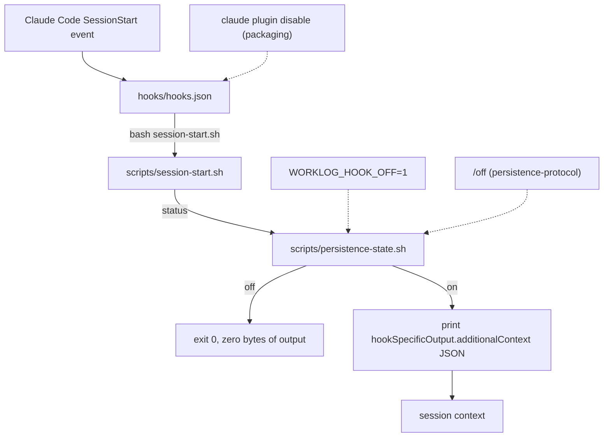

# session-hook

The SessionStart hook that reminds a fresh session of the Outline durable-memory
rule, and the off switch that gates it. Read [`../CONVENTIONS.md`](../CONVENTIONS.md)
before changing anything here, and [`../README.md`](../README.md) for how this
block fits the rest of the plugin.

## What this block is

Three files. `hooks/hooks.json` wires the plugin into Claude Code's `SessionStart`
lifecycle event `[verified]`. `scripts/session-start.sh` is the command that event
runs; it prints one line of JSON carrying the reminder text, or nothing at all
`[verified]`. `scripts/persistence-state.sh` owns the single on/off marker file
that decides which of those two outcomes happens `[verified]`.

The hook never calls Outline and never calls an MCP tool. It only emits static
text that names the MCP server `[verified]`; resolving which tool prefix actually
answers to that name is the job of the skill in
[`persistence-protocol`](../persistence-protocol/README.md), which explicitly
warns against relying on one prefix, spelling out the plugin-scoped alternative
(`skills/worklog-persist/SKILL.md::"mcp__plugin_worklog-persist_outline__*"`)
`[verified]`.

## Boundary

This block does not own:

- the skill or the seven slash commands, including `/off`, which only wraps the
  script this block owns (`persistence-protocol`, one sentence and a link, per
  `../CONVENTIONS.md`)
- the plugin manifest, the marketplace entry, `.mcp.json`, or `install.sh`,
  including the structural check that this block's two scripts exist on disk
  (`packaging`, see [`../packaging/CONTRACTS.md`](../packaging/CONTRACTS.md))
- the test suites that exercise this block's files
  (`verification`, see [`../verification/README.md`](../verification/README.md))

## File inventory

| Path | Role |
|---|---|
| `hooks/hooks.json` | Registers `scripts/session-start.sh` against the `SessionStart` event `[verified]` |
| `scripts/session-start.sh` | Reads the off state, then emits `hookSpecificOutput.additionalContext` JSON or nothing `[verified]` |
| `scripts/persistence-state.sh` | Resolves the state directory, and implements `path`, `status`, `off`, `on` `[verified]` |

## Why it depends on packaging and persistence-protocol

`${CLAUDE_PLUGIN_ROOT}` in `hooks/hooks.json::"${CLAUDE_PLUGIN_ROOT}"` is an
environment variable the plugin loader supplies, not something this block
defines `[inferred]`, and `install.sh::check_structure()` fails the whole install
if `scripts/session-start.sh` or `scripts/persistence-state.sh` is missing
`[verified]`; that ties this block to `packaging`. The `/off` command
(`commands/off.md`) and the skill both shell out to
`scripts/persistence-state.sh`, and the reminder text names the `outline` MCP
server whose prefix resolution belongs to the skill; that ties this block to
`persistence-protocol` `[verified]`.

## Flow

The two dotted paths cross out of this block: the env var is set by whoever runs
the session, `/off` is a persistence-protocol command, and disabling the whole
plugin is a packaging-level action that removes the hook registration entirely
rather than toggling the marker file `[verified]`.
