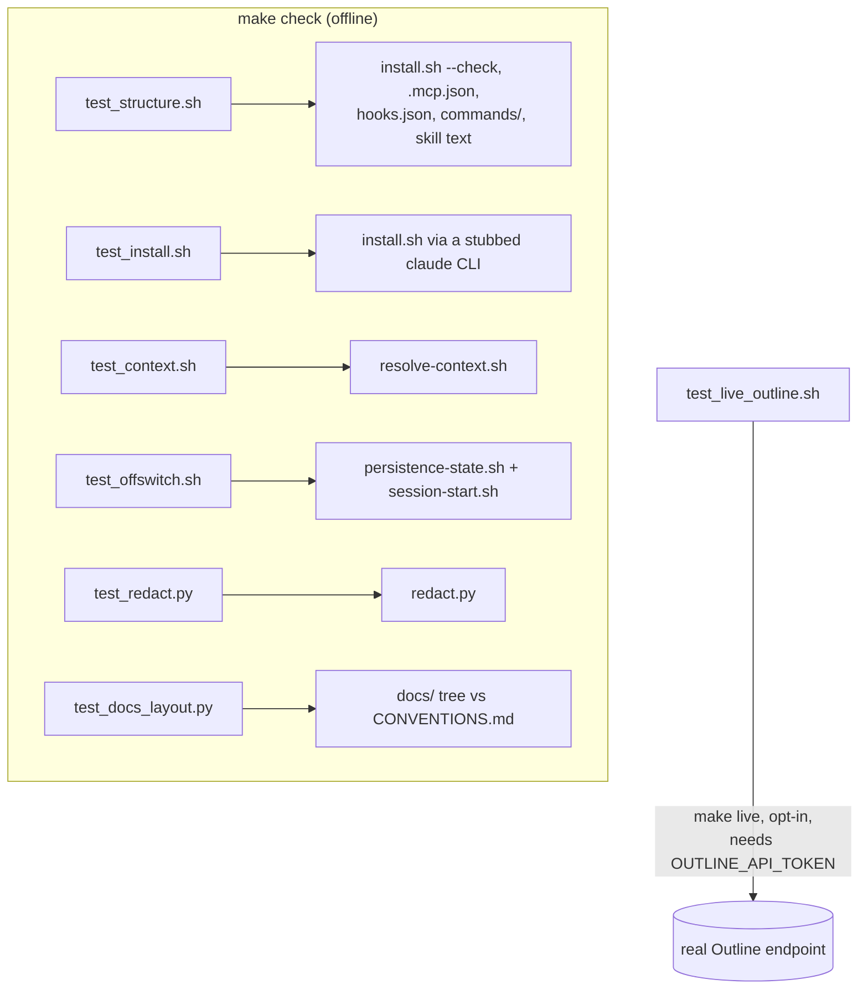

# verification

The test suites for `worklog-persist`, what each one proves, and what nothing in
this repo proves. Read [`../CONVENTIONS.md`](../CONVENTIONS.md) before you write
here.

This block owns `tests/` only. It does not own `install.sh`, the `Makefile`, or
any script under `scripts/`; those belong to
[`packaging/`](../packaging/README.md), [`session-hook/`](../session-hook/README.md)
and [`persistence-protocol/`](../persistence-protocol/README.md). This page cites
the `Makefile` targets that run the suites, because that is the entry point a
reader needs, but the installer and registration targets are documented in
`packaging/`. [inferred]

---

## What this block is

Seven suites, six of them offline. Four are plain shell scripts run with `bash`,
not collected by `pytest`: `Makefile::"Not collected by pytest"` is the comment
that explains why `make test` alone would miss them. [verified] Two are `pytest`
modules: `tests/test_redact.py` and `tests/test_docs_layout.py`. [verified] The
seventh, `tests/test_live_outline.sh`, is opt-in and touches a real network
endpoint; it never runs as part of `Makefile::"Everything offline: both suites plus the structure check"`.
[verified]

`tests/test_docs_layout.py` is the suite that checks this very `docs/` tree
against the rules in [`../CONVENTIONS.md`](../CONVENTIONS.md), including the file
you are reading. [verified]

---

## How the suites map to entry points

See [`OPERATIONS.md`](OPERATIONS.md) for the exact commands and required tools.

---

## Boundary

This block records what a suite proves and what it does not. It does not restate
the behaviour of `install.sh`, `redact.py`, `resolve-context.sh` or
`session-start.sh` themselves; those facts live in the block that owns that code,
per `docs/CONVENTIONS.md::"Where a fact lives"`. [verified] The suites that
exercise those scripts are still described here, because the suite and its
guarantees are this block's own file. [inferred]

See [`CONTRACTS.md`](CONTRACTS.md), [`INVARIANTS.md`](INVARIANTS.md),
[`GAPS.md`](GAPS.md) and [`OPERATIONS.md`](OPERATIONS.md) for the rest.
